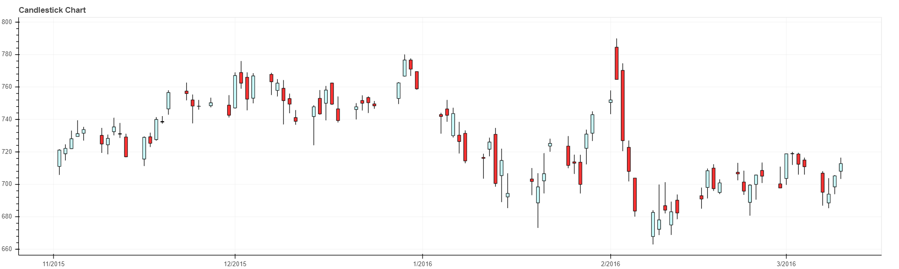

# Bokeh-Stock-Analysis
Stock analysis of Google using Bokeh library using Python 3.7.
  
The stock prices of **Google** from 1st Nov, 2015 to 10th March, 2016 (12 hours at a time) have been visualised on a **Candlestick chart**.
The source of data is **Yahoo** and its extraction has been implemented using **pandas_datareader** library.
  
  
**Snapshot**

  
  
Also, the output file named **Candle.html** will be created after successful execution of the program.
